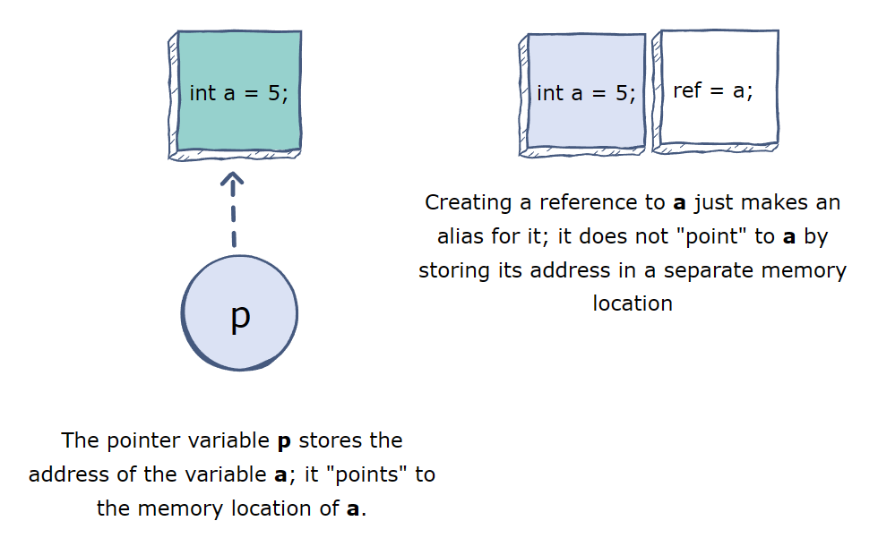
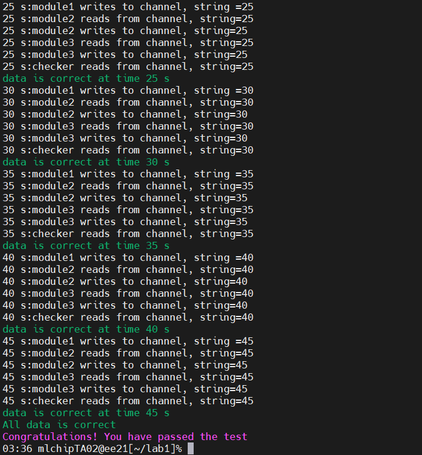

# MLCHIP Lab01
###### 上課時間 : 2025/03/18
[TOC]

## Basic of C++
- pointers and references
    - A pointer is a variable that holds the memory address of another variable. A pointer needs to be dereferenced with the * operator to access the memory location it points to.
    - A reference variable is an alias, that is, another name for an already existing variable.


- Template : Pass the data type as a parameter so that we don’t need to write the same code for different data types.
```cpp
template<typename T>
class TheClassName {
	// T can be treated as a type inside the class definition block
}

int main() {
	TheClassName<int> a;
	TheClassName<double> b;
	TheClassName<AnotherClassName> c;
}
```
- Operator Overloading : giving special meaning to an existing operator in C++ without changing its original meaning
```cpp
struct Complex {
   Complex( double r, double i ) : re(r), im(i) {}
   Complex operator+( Complex &other );
   void Display( ) {   cout << re << ", " << im << endl; }
private:
   double re, im;
};

// Operator overloaded using a member function
Complex Complex::operator+( Complex &other ) {
   return Complex( re + other.re, im + other.im );
}

int main() {
   Complex a = Complex( 1.2, 3.4 );
   Complex b = Complex( 5.6, 7.8 );
   Complex c = Complex( 0.0, 0.0 );

   c = a + b;
   c.Display();
}
```

## `sc_signal`讀寫數據方式
要從`sc_signal`這個class讀取訊號，有兩種方法，可以call member function`T& read()`或是運算子重載`()`。
```cpp
sc_signal<int> s;
// method 1 - member function
std::cout << s.read();
// method 2 - operator overloading
std::cout << (s);
```
同理，要從`sc_signal`這個class寫入訊號，有兩種方法，可以call member function`void write(const T&)`或是運算子重載`=`。
```cpp
sc_signal<int> s;
// method 1 - member function
s.write(5);
// method 2 - operator overloading
s = 5;
```

## 如何在`sc_signal`選取指令bit數 
給定指令
```cpp
sc_signal<sc_uint> instruction;
```
想法 : `sc_uint`的class有提供成員函數 `range(int high, int low)`和運算子重載 `operator(int high, int low)`，所以可以...
```cpp
instruction.range(4, 0); \\ compile error
```
錯誤原因 : 雖然`sc_uint`的class有提供選取指令bit數，但`sc_signal`並沒有，所以需要先從`sc_signal`讀取出`sc_uint`的數據，再使用`sc_uint`的成員函數或運算子重載。
```cpp
sc_signal<sc_uint> instruction;
// method 1 - member function / member function
instruction.read().range(4, 0);
// method 2 - member function / operator overloading
(instruction.read())(4,0)
// method 3 - operator overloading / member function
(instruction).range(4, 0)
// method 4 - operator overloading / operator overloading
(instruction)(4, 0)
```

## `SC_CTOR(module)`和`SC_HAS_PROCESS(module)`差別
兩者在`SC_MODULE`初始化，都會把`SC_MODULE`的member functions註冊到SystemC的simulation kernel，因此才能跑simulation process。
    
- `SC_CTOR(module)`有提供預設的constructor，這個constructor只有一個argument - module name。
- `SC_HAS_PROCESS(module)`並沒有提供預設的constructor，需要使用者自行定義constructor。

因此根據上述特性，當module不需要module name以外的參數進行初始化時，則使用`SC_CTOR(module)`，就能調用預設的constructor；而當module需要module name以外的參數進行初始化時，則使用`SC_HAS_PROCESS(module)`，由使用者自行定義constructor需要哪些constructor的argument。
```cpp
#include <systemc.h>
SC_MODULE(MODULE_A) { // module without simulation processes doesn't need SC_CTOR or SC_HAS_PROCESS
  MODULE_A(sc_module_name name) { // c++ style constructor, the base class is implicitly instantiated with module name.
    std::cout << this->name() << ", no SC_CTOR or SC_HAS_PROCESS" << std::endl;
  }
};

SC_MODULE(MODULE_B) { // constructor with module name as the only input argument
  SC_CTOR(MODULE_B) { // implicitly declares a constructor of MODULE_A(sc_module_name)
    SC_METHOD(func_b); // register member function to simulation kernel
  }
  void func_b() { // define function
    std::cout << name() << ", SC_CTOR" << std::endl;
  }
};

SC_MODULE(MODULE_C) { // pass additional input argument(s)
  const int i;
  SC_HAS_PROCESS(MODULE_C); // OK to use SC_CTOR, which will also define an un-used constructor: MODULE_A(sc_module_name);
  MODULE_B(sc_module_name name, int i) : i(i) { // define the constructor function
    SC_METHOD(func_c); // register member function
  }
  void func_c() { // define function
    std::cout << name() << ", additional input argument" << std::endl;
  }
};

int sc_main(int, char*[]) {
  MODULE_A module_a("module_a");
  MODULE_B module_b("module_b");
  MODULE_C module_c("module_c", 1);
  sc_start();
  return 0;
}

```

## `SC_METHOD(func)`和`SC_THREAD(func)`差別
- `SC_METHOD(func)`沒有自己的執行緒，不會消耗模擬時間，不能呼叫函數`wait()`，使用`next_trigger()`就能建立dynamic sensitivity，當trigger就會執行，因此不需要使用無窮迴圈也能反覆執行。
- `SC_THREAD(func)`有自己的執行緒，可能會消耗模擬時間，使用`wait()`就能建立dynamic sensitivity，需要使用無窮迴圈。
- 另外一種`SC_CTHREAD(func, event)`是`SC_THREAD(func)`的特殊形式，只有static sensitivity，而且所sensitivity的event通常是設置為clock。

|Simulation Process|SC_METHOD|SC_THREAD|SC_CTHREAD|
|---|---|---|---|
|Execution|When trigger|Always execute|Always execute|
|Suspend time|No|Yes|Yes|
|Static sensitivity|By sensitive list|By sensitive list|By clock event|
|Dynamic sensitivity|`next_trigger()`|`wait()`|X|
|Inifinite Loop|No|Yes|Yes|
|Applied model|RTL, synchronize|Behavioral|Clocked behavior|

```cpp
#include <systemc.h>
SC_MODULE(PROCESS) {
  sc_clock clk; // declares a clock
  SC_CTOR(PROCESS) : clk("clk", 1, SC_SEC) { // instantiate a clock with 1sec periodicity
    SC_METHOD(method); // register a method
    SC_THREAD(thread); // register a thread
    SC_CTHREAD(cthread, clk); // register a clocked thread
  }
  void method(void) { // define the method member function
    // no while loop here
    std::cout << "method triggered @ " << sc_time_stamp() << std::endl;
    next_trigger(sc_time(1, SC_SEC)); // trigger after 1 sec
  }
  void thread() { // define the thread member function
    while (true) { // infinite loop make sure it never exits 
      std::cout << "thread triggered @ " << sc_time_stamp() << std::endl;
      wait(1, SC_SEC); // wait 1 sec before execute again
    }
  }
  void cthread() { // define the cthread member function
    while (true) { // infinite loop
      std::cout << "cthread triggered @ " << sc_time_stamp() << std::endl;
      wait(); // wait for next clk event, which comes after 1 sec
    }
  }
};

int sc_main(int, char*[]) {
  PROCESS process("process"); // init module
  std::cout << "execution phase begins @ " << sc_time_stamp() << std::endl;
  sc_start(2, SC_SEC); // run simulation for 2 second
  std::cout << "execution phase ends @ " << sc_time_stamp() << std::endl;
  return 0;
}
```
Result
```cpp
// module instantiation finished 
execution phase begins @ 0 s
// all processes are triggered once
method triggered @ 0 s
thread triggered @ 0 s
cthread triggered @ 0 s
// all processes are triggered again after 1 sec, using different methods
method triggered @ 1 s
thread triggered @ 1 s
cthread triggered @ 1 s
// simulation ends after 2 seconds
execution phase ends @ 2 s
```
## `sc_port`用法
port指向channel的pointer，需要先port去connect (bind)到channel上，讀取資料時，需要先將port做解引用得到port所指向的channel，再使用channel的member function`write()`和`read()`讀取資料。
```cpp
#include <systemc.h>
#include <string>

SC_MODULE(MODULE1) {                  // top-level module
    sc_port<sc_signal_out_if<std::string>> p; // port
    SC_CTOR(MODULE1) {
        SC_THREAD(writer);
    }
    void writer() {
        std::string text = "DCS_Lab02_"; // init value
        while (true) {
            std::string write_data = text + std::to_string((int)sc_time_stamp().to_seconds());
            p->write(write_data); // writes to channel through port
            std::cout << sc_time_stamp() << ":" << name() << " writes to channel, string=" << write_data << std::endl;
            wait(1, SC_SEC);
        }
    }
};

SC_MODULE(MODULE2) {
    sc_port<sc_signal_in_if<std::string>> p;
    SC_CTOR(MODULE2) {
        SC_THREAD(reader);
        sensitive << p; // triggered by value change on the channel
        dont_initialize();
    }
    void reader() {
        while (true) {
            std::cout << sc_time_stamp() << ":" << name() << " reads from channel, string=" << p->read() << std::endl;
            wait(); // receives from channel through port
        }
    }
};

int sc_main(int, char *[]) {
    MODULE1 module1("module1"); // instantiate module1
    MODULE2 module2("module2"); // instantiate module2
    sc_signal<std::string> s;   // define channel outside module1 and module2
    module1.p(s);               // bind module1's port to channel, for writing purpose
    module2.p(s);               // bind module2's port to channel, for reading purpose
    sc_start(2, SC_SEC);
    return 0;
}
```
Result
```
0 s:module1 writes to channel, string=DCS_Lab02_0
0 s:module2 reads from channel, string=DCS_Lab02_0
1 s:module1 writes to channel, string=DCS_Lab02_1
1 s:module2 reads from channel, string=DCS_Lab02_1
```

## Lab01 SPEC


同學需要完成15個程式空格。module1每隔5秒會生成並傳一次字串，完成module1 -> module2 -> module3 -> checker的傳輸，並限定使用`sc_port`指向channel來傳輸資料，另外module3限定使用
1. simulation process : `SC_METHOD`
2. instantiation : `SC_HAS_PROCESS`
   

以讓同學了解`SC_METHOD`和`SC_THREAD`之間差異、`SC_HAS_PROCESS`和`SC_CTRL`之間差異。

而程式會將從module1產生的字串直接傳給checker，與同學寫的module1 -> module2 -> module3 -> checker字串比對，以檢查傳輸是否正確。

## Expected Result
每一個channel讀寫皆會輸出資料。<br>



## Lab01 Tips
- (1、2、10、11) 將資料寫入 / 讀出channel要怎麼寫? 將port做解引用，並調用member function `write(), read()`，將生成出的字串寫入channel。語法請看[sc_port用法](#sc_port用法)。
- (3) wait on events in sensitivity list，語法請看[Combined Events](https://www.learnsystemc.com/basic/event_combined)。
- (4)定義port。語法請看[sc_port用法](#sc_port用法)。
- (6)如何宣告`SC_HAS_PROCESS`。語法請看[SC_CTOR(module)和SC_HAS_PROCESS(module)差別](#SC_CTOR(module)和SC_HAS_PROCESS(module)差別)
- (7、12) `SC_METHOD`要如何trigger?。語法請看[SC_METHOD(func)和SC_THREAD(func)差別](#SC_METHOD(func)和SC_THREAD(func)差別)。
- (8) 當p2的值發生改變時，會觸發`SC_METHOD(transfer)`執行，因此需要把`p2`加入sensitivity list。
- (9) ` SC_METHOD(transfer)`在程式初始化就會被呼叫?要如何避免他呼叫呢?語法請看老師講義lec2 P47。
- (13、14、15)如何將port bind到channel?語法請看[sc_port用法](#sc_port用法)。

## Command List
1. Extract files from TA’s directory 
```
tar -xvf ~mlchipTA01/lab1.tar
```
2. Compile & Run SystemC source code
```
make
```
3. Clean SystemC executable file
```
make clean
```
4. Submission Process Step 1
```
./00_tar
```
5. Submission Process Step 2
```
./01_submit
```
6. Submission Process Step 3
```
./02_check
```

## 評分標準
- 2025/03/19晚上11點59分以前繳交到伺服器，得100分。
- 不接受遲交。